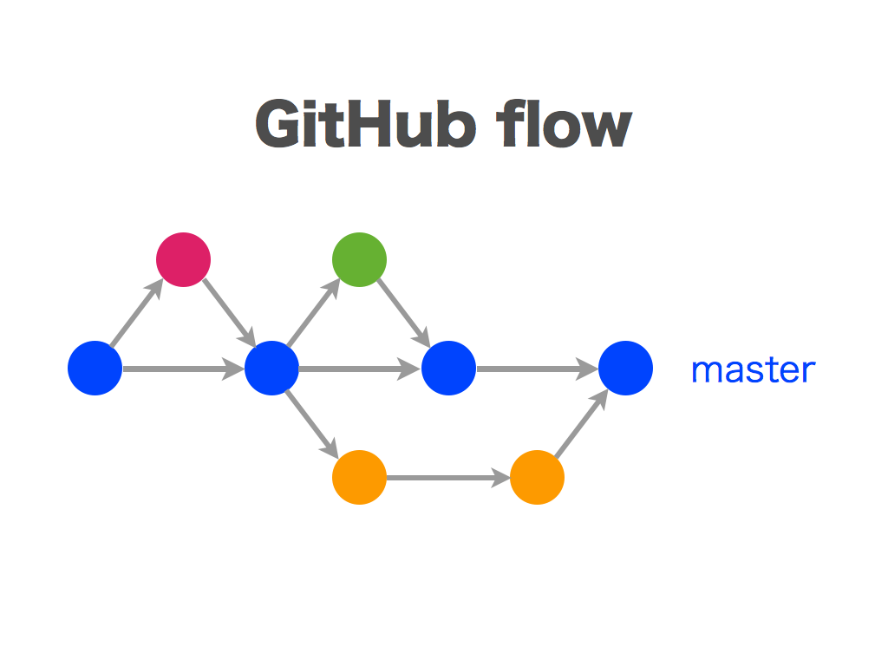

# GitHub Flow

 큰 규모의 프로젝트가 아니라고 판단하여 GitHub Flow 를 선택했다. 바로바로 배포가 가능하게 한다.
항상 배포가 가능한 상태이므로 Commit Message 와 작업 브랜치명을 명확하게 작성해준다.

## Branch And Commit

 - **브랜치 명은 큰 작업단위로 명확하게 작성**
 - Branch Name :: [작업종류]/[#Issue Number]-[작업내용] 
   - 4가지의 작업종류를 나눕니다.
     - add
     - update
     - fix
     - bug
   - 이슈 번호를 링크
   - 큰 작업내용을 작성합니다.
     - 띄워쓰기는 '_' 사용
 - **commit message**
   - Commit Message 는 세부 작업단위로 작성
   - [#Issue Number] 작업 제목
     - 세부 내용
 - 예시) add/#1-Article_Domain_CRUD
   - #1 Article Entity 생성
   - #1 Article Repository 생성
   - #1 Article CRUD Test
     - Junit5 를 사용하여 CRUD TEST 진행

## Merge

- create a merge commit 옵션 사용
   : merge commit 이 남는다. master 브랜치에는 merge 시점이 필요하니 해당 전략을 사용한다. 
기존에는 이 전략을 모든 브랜치에 사용해서 커밋 히스토리 곳곳에 머지 커밋이 자주 나타난다.

- fix → 작업 브랜치: squash and merge 옵션 사용
    : PR 의 커밋 로그를 하나로 묶을 수 있다. 기능 단위로 커밋을 정리한 후 반영하기 때문에
  히스토리가 깔끔해진다.
